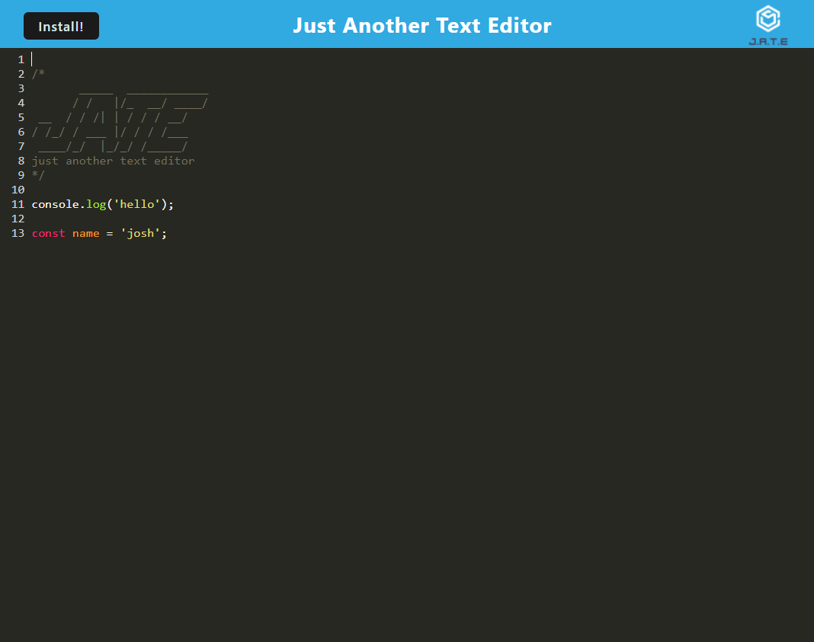

# pwa-text-editor

## Description

[Text Editor](https://morning-refuge-10692-76df8b5397e0.herokuapp.com/)

The Text Editor app is a single page web application that can also be used as a Progressive Web Application (PWA) and installed as a desktop app. The application uses the idb npm package to store data using the IndexedDB API in the browser. It also makes use of service workers to cache files which enables offline functionality. Webpack plugins were also used to bundle assets, increasing overall performance of the app.

## Installation

N/A

## Usage

The command 'npm run start' can be invoked at the root of the directory to run the app locally. Text can be typed in the text editor and the text is saved to the IndexDB database in the browser. When closed out and reopened, the saved text is repopulated in the text editor. The application can be ran offline and installed as a desktop application for offline functionality.

## Credits

Instructor provided code can be found in the code and is noted with comments. Instructor also provided help with service worker functionality.